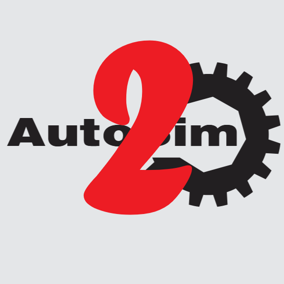

# INFO

Automotive simulator application, built with gtk.

## Development Information

### Version Information:

| Version | Date | Notes |
|---|---|---|
| 0.01 | 29/09/2025 | Initial workspace interface |
| 0.10 | 02/10/2025 | Workspace interface with macros, demonstration workspace, no backend |

### In-development list

(in no particular order)

 - Logo for app
 - Correct demo workspaces setup
 - Demonstration macros
 - Ability to edit workspaces in-app
 - Macro creation in app
 - Macro recording
 - Back-end interfaces
 - Settings interface
 - Communication interface

## Build Information

build with:

```
make
```
(will also make the independent macro_runner, review [Readme_macro.md](ind_macro/Readme_macro.md) for some more explanation)

run with 

```
./autosim
```

## Use Information

 - New workspace will load a default workspace and interface

 - Load workspace is used to load a .csv defined workspace

## Licence/ Declaration

All code is developed by John Savill, not for public use.